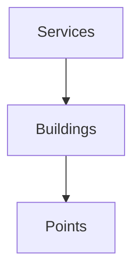
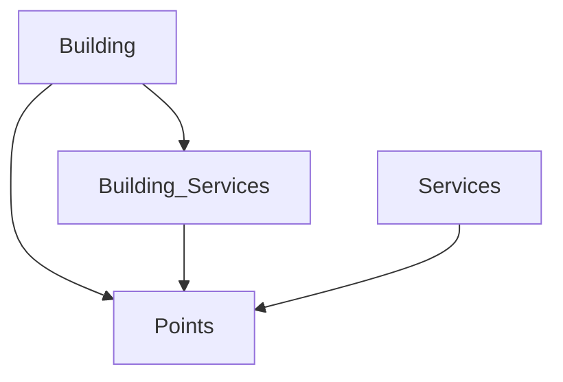

# FP&M Map Project
**Overview**

Our goal is to work with FP&M to create dynamic real-time visualizations of data on campus services. The ability to see this data should improve their ability to react to changes and fluctuations in these services. 

**Definitions**
- *eDNA* is the web service used by FP&M to collect data on campus and display it. An API exposes this data to read real-time values
- *CHaD* is the abstract objects inside *eDNA*. CHaD can contain many different points and attributes such as: building number, monitoring type, etc.
- *Point* is the actual value contained by a CHaD. Points contain a unique ID and a value.
- *Service* is the meaning behind the data being monitored: chillers, heaters, pressure gauges, etc.

**eDNA Structure**

We are currently struggling to overcome data that is poorly formatted for geolocation data. *eDNA*'s current structure means we are making many API requests to get our data. We want to reduce the number of API calls to speed up the application and ensure its utility is preserved through that.

The current structure:

In order to get the points, we have to get services, then buildings, then points. 

The desired structure:

- We **don't** need to grab all buildings. 
- We **don't** need to grab all services.
- We **do** need to grab a building's points given a building's ID.
- We **do** need to grab a building's services given a building's ID.
- We **do** need to grab service's data points given a service's type.

Imagine selecting a service like Chillers. All chiller data shows up on the map. Now, imagine something has gone wrong in WCCF. The chiller is showing 100 degree temperatures. You want to be able to click on the building and see that data to confirm. We want to be able to grab the building ID and immediately display the Point. We don't want to have to somehow grab the ID -> filter through the building services -> then show the Point. Not only does that take time, but it's very hard for you to organize your data in a way that makes that work. It's much easier to expose points as children of buildings, to make points children of services, *and* make services children of buildings.

Buildings should own points
Buildings should own services
Services should own points

**Visualizations and Services**

Each service has unique needs and we want to serve those needs by provided visualizations that clearly identify the service. For example, services dealing with heat might default to a heat-map.

There are 20+ services on campus. So, instead of enumerating each service, I'll enumerate their *types*: pressure, temperature, volume, rate, and power.

- *Temperature* should be represented globally as a heat map. Cold should always be blue. Hot should always be red.
- *Volume* should be represented globally as a height map with height dependent on volume (smaller height equals less volume)
- *Pressure* should be represented globally as a circle with radius dependent on volume. 
- *Rate* should be represented as a height map (smaller height equals slower rate)
- *Power* should be represented as a height map (smaller height equals less power)

The logic is that, basically, services that are **not** working correctly, should be apparent on the map. A large radius on a circle is easy to spot, but a small radius is not. So, things that should **not** be big should be circles (like pressure). A small bar height on the map, at an angle, should be easy to spot. So, things that should **not** be very low, should be bars (such as power, volume?, and rate).

We hope to be able to provide many different visualization options for each type, but the default should be what is listed above. 

**Buildings**

Buildings should be the fallback for information. They should be able to expose raw data as clearly as possible so that, if a user is unclear about a service's "health", the data should give them greater clarity. Buildings are capable of housing hundreds of points, so we might want to have a cross-section in data representation wherein a user can only review points that have the same service type as the service selected. Thus, reducing information overflow and keeping the UI simple. 